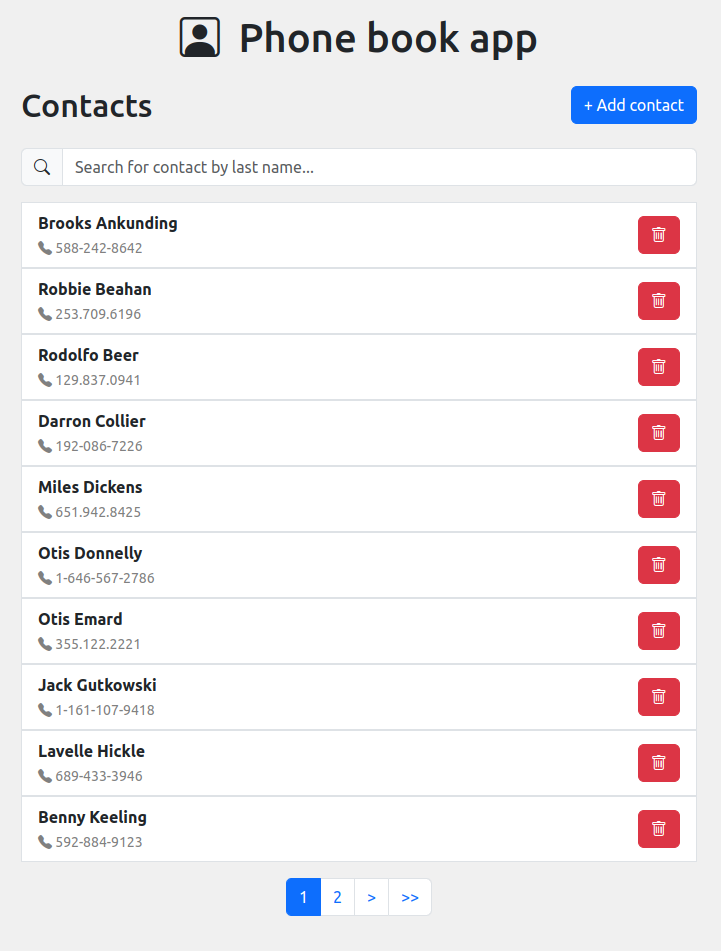

# PhoneBookApp

## Versions

- ubuntu 22.04
- ruby 3.2.0
- bundle 2.4.14
- node 18.14.0
- yarn 1.22.10

## Setup


1. Clone the repository
```bash
git clone git@github.com:adriatp/phone-book-app.git
cd phone-book-app
```

2. Install the gems
```bash
bundle install
```

3. Create the `application.yml` file
```bash
cp config/application.example.yml config/application.yml
```

4. Set the credentials for db in `application.yml`

5. Create, migrate and populate the database
```bash
rails db:create
rails db:migrate
rails db:seed
```

6. Run tests and run the server
```bash
rails test:all
rails s
```

7. Access `localhost:3000` to use the app

